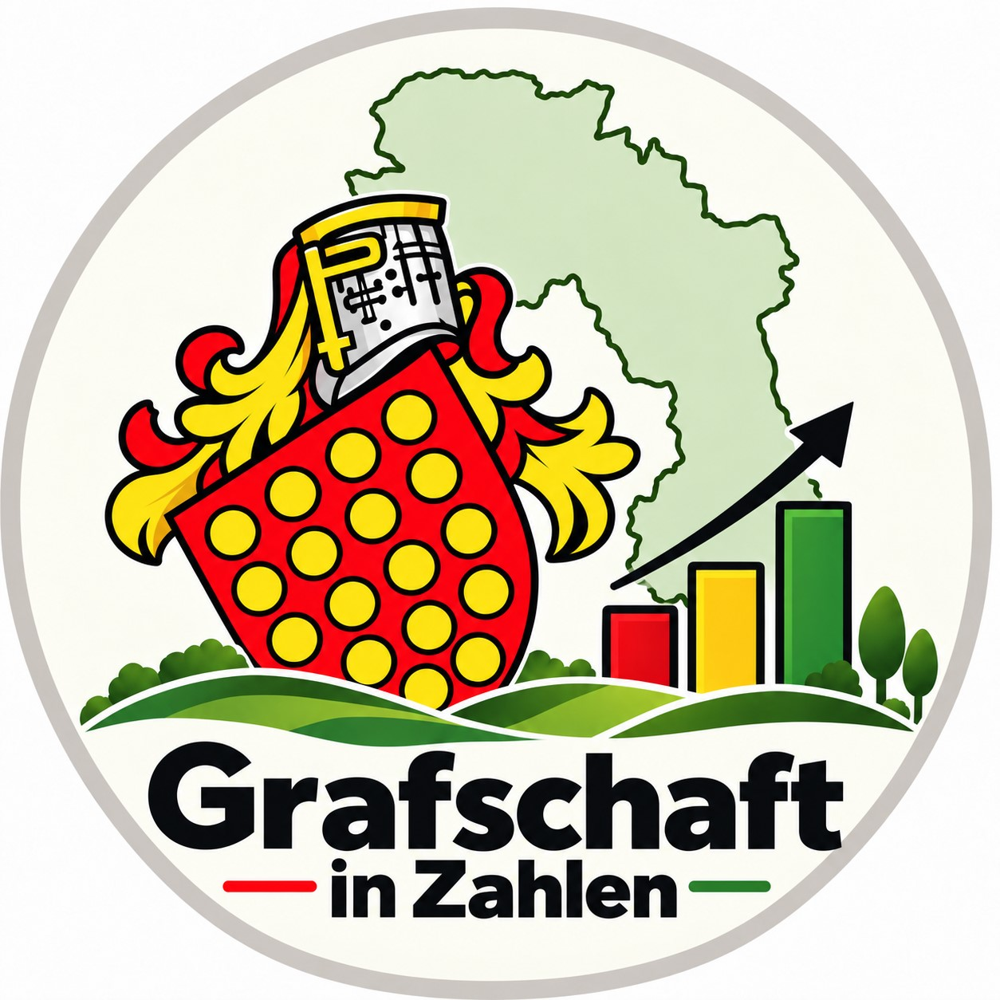

::: {.hero-giz}

::: {.hero-logo}
{width=230px}
:::

::: {.hero-text}

# Grafschaft in Zahlen

## Zahlen, Daten und Fakten aus der Grafschaft Bentheim

**Grafschaft in Zahlen** bereitet statistische Daten zum Landkreis Grafschaft Bentheim und seinen Gemeinden verständlich, transparent und anschaulich auf.

Im Mittelpunkt stehen langfristige Entwicklungen, regionale Unterschiede und interaktive Darstellungen.

:::

:::


## Aktuelles

Hier findest du die neueste Analyse aus **Grafschaft in Zahlen**.

::: {#aktuelle-news}
:::

[**Alle Beiträge ansehen →**](news.qmd)


## Daten entdecken

```{=html}
<div class="themen-grid">

  <a id="thema-bevoelkerung"
     class="themen-kachel"
     href="bevoelkerung.html">

    <div class="themen-icon">
      <i class="bi bi-people-fill"></i>
    </div>

    <div class="themen-titel">
      Bevölkerung
    </div>

    <div class="themen-text">
      Bevölkerungsentwicklung, Altersstruktur und Unterschiede zwischen den 25 Gemeinden.
    </div>

  </a>


  <a id="thema-gesundheit"
     class="themen-kachel"
     href="gesundheit.html">

    <div class="themen-icon themen-icon-gesundheit">
      <i class="bi bi-heart-pulse-fill"></i>
    </div>

    <div class="themen-titel">
      Gesundheit
    </div>

    <div class="themen-text">
      Gesundheitsdaten, Erkrankungen und regionale Unterschiede in der Grafschaft Bentheim.
    </div>

  </a>


  <a id="thema-landwirtschaft"
     class="themen-kachel"
     href="landwirtschaft.html">

    <div class="themen-icon themen-icon-landwirtschaft">
      <span aria-hidden="true">🌾</span>
    </div>

    <div class="themen-titel">
      Landwirtschaft
    </div>

    <div class="themen-text">
      Tierhaltung, Agrarstrukturen und spannende Vergleiche zwischen den Gemeinden.
    </div>

  </a>

</div>

<div class="themen-hinweis">
  Weitere Themenbereiche werden schrittweise ergänzt.
</div>
```


## Grafschaft in Zahlen auf Instagram

```{=html}
<div class="instagram-box">

  <div class="instagram-icon">
    <i class="bi bi-instagram"></i>
  </div>

  <div class="instagram-inhalt">

    <div class="instagram-titel">
      @grafschaftinzahlen
    </div>

    <div class="instagram-text">
      Neue Grafiken, interessante Zahlen und aktuelle Entwicklungen aus der
      Grafschaft Bentheim gibt es auch auf Instagram.
    </div>

    <a
      class="instagram-button"
      href="https://www.instagram.com/grafschaftinzahlen/"
      target="_blank"
      rel="noopener noreferrer">
      <i class="bi bi-instagram"></i>
      Auf Instagram folgen
    </a>

  </div>

</div>
```


## Über das Projekt

**Grafschaft in Zahlen** ist ein unabhängiges Statistikprojekt. Die verwendeten Daten stammen überwiegend aus amtlichen und öffentlich zugänglichen Datenquellen.

Ziel ist es, Zahlen zur Grafschaft Bentheim verständlich aufzubereiten und Entwicklungen auf Ebene des Landkreises und seiner Gemeinden sichtbar zu machen.